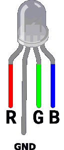
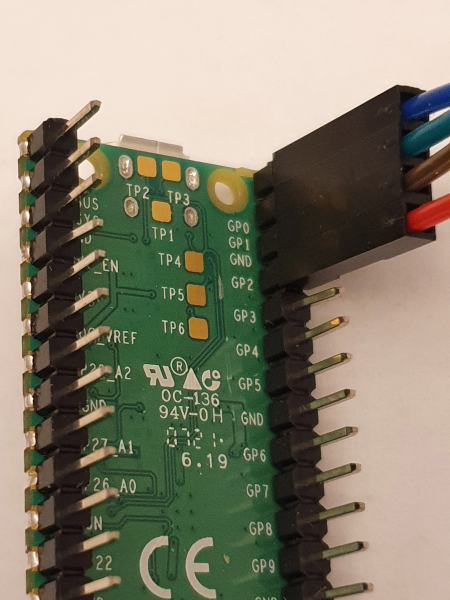
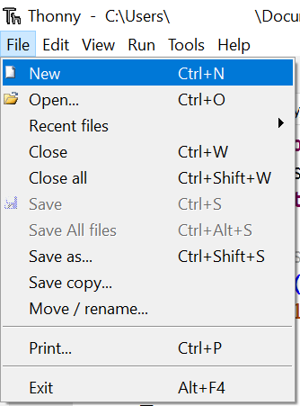

## Light your RGB LED

Connect a RGB (full colour) LED to your Raspberry Pi Pico and light it in a colour you choose.

Image, gif or video showing what they will achieve by the end of the step. {:width="300px"}

In the LED Firefly project, you used an LED to imitate the blinking of a firefly. In this project, you will be using a different kind of LED, called an RGB LED. RGB LEDs allow you to change the colour of the light emitted. RBG stands for <b>R</b>ed <b>G</b>reen <b>B</b>lue, and tells you that the LED has three **colour channels** you can change using code.

<b>NOTE:</b> This project uses an RGB LED to achieve the light show for the party popper, but if you don't have an RGB LED you could just use your favourite colour of regular LED. The code will be very slightly different if you do. 

[[[generic-theory-simple-colours]]]

--- task ---

Make sure your Raspberry Pi Pico is disconnected from your computer before attaching any components, as you may overload or short the connections and damage them. 

--- /task ---

--- task ---
Make sure that you have an RGB LED connected to resistors and jumper wires. The colour of the jumper wires can help you identify the proper colour channels later.

Wire your RGB LED ready to connect to the Pico using the instructions here:

[[[rgb-led-resistor-electrical-tape]]]

[[[rgb-led-resistor-solder-heat-shrink]]]

--- /task ---

--- task ---
An RGB LED has four legs, one for each colour and one for a shared connection to GND.

The jumper wires connected to your LED should be colour coded. 

Look at your RGB LED and make sure you can identify the four legs. 

--- /task ---

--- task ---

Turn your Raspberry Pi Pico upside down and find the pins labelled GP2, GND, GP1 and GP0. 

Connect the red jumper wire of your RGB LED to pin 2, the ground (negative) to GND, green to GP1 and blue to GP0:

--- /task ---

--- task ---

COnnect your Raspberry Pi PIco to your computer using the MicroUSB cable. 

--- /task ---

--- task ---

Create a new file in Thonny by clicking File > New in the top menu bar. An empty workspace should open.

--- /task ---

--- task ---
**Type** the following code into Thonny: 

Here, you are **importing** the libraries you need to make your party popper work and setting up a variable for your RGB LED.

--- code ---
---
language: python
filename: partypopper.py
line_numbers: true
line_number_start: 1
line_highlights: 
---
from picozero import *
from time import sleep

rgb = RGBLED(red=2, green=1, blue=0) # pin numbers 

def pop():
    print("Pop")
    rgb.color = (250, 0, 250) # purple
    sleep(2)
    rgb.off()

pop()
--- /code ---

--- /task ---

--- task ---
**Test:** Run your script and check that the RGB LED turns purple (maximum red and maximum blue.) for two seconds and then turns off. 

**Debug:**

If the code doesn't run:
+ Check the Thonny console for any error messages and fix your code so it looks exactly like the example. 

If the RGB LED doesn't light up:
+ Check that the jumper wires are connected to the correct pins. 
+ Check for any lose connections. 
+ Check the LED has not blown.

If the RGB LED comes on but is not purple:
+ You may have the LED legs connected to the wrong pins. Try setting the RGB LED to the following colours and make sure that they RGB LED shows the right colour: red: `(255, 0, 0)`, green: `(0, 255, 0)`, blue: `(0, 0, 255)`. Swap the jumper wires if you need to. If only one colour works then you may have the ground leg connected to colour for that pin. 

--- /task ---

--- task ---
If you would like a different colour then change the numbers that set the colour to purple to one of:

+ Red: (255, 0, 0)
+ Green: (0, 255, 0)
+ Blue: (0, 0, 255)
+ Cyan: (0, 255, 255)
+ Yellow: (255, 255, 0)
+ Pink: (255, 0, 50)

Try adjusting the numbers to get the right balance. 

**Tip:** Mixing red, green and blue creates white. 

--- /task ---

--- save ---