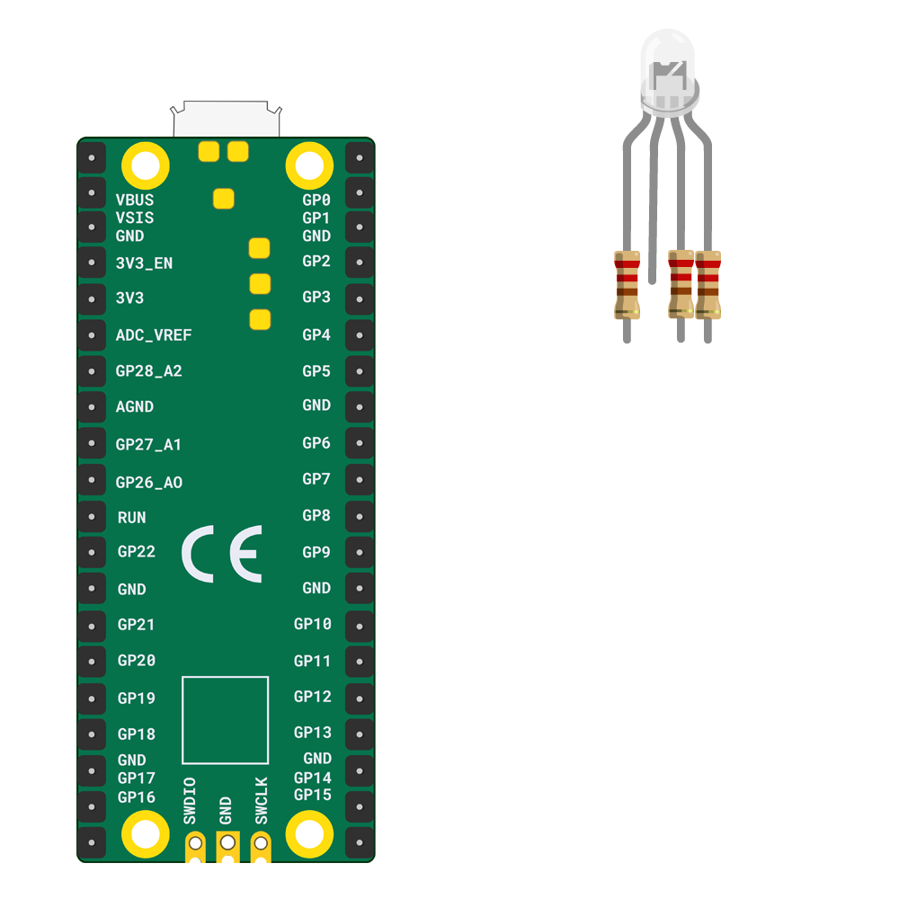

## Light your RGB LED

In the LED firefly project, you used a single-colour LED. For your party popper, you will add an RGB (full colour) LED to your Raspberry Pi Pico and light it in a colour you choose.

{:width="300px"}

RGB stands for Red Green Blue. <b>RGB LEDs</b> allow you to use code to control how much of each colour is emitted.

[[[generic-theory-simple-colours]]]

--- task ---

Make sure your Raspberry Pi Pico is **disconnected** from your computer before attaching any components, as you may overload or short the connections and damage them. 

--- /task ---

--- task ---

Wire your **RGB LED** ready to connect to the Pico using the instructions here:

[[[rgb-led-resistor-electrical-tape]]]

[[[rgb-led-resistor-solder-heat-shrink]]]

--- /task ---

--- task ---

An RGB LED has **four** legs, one for each colour and one for a shared connection to **GND**.

Look at your RGB LED and make sure you can identify the four legs. In the diagram above, from left to right, the first leg is the **Red** leg, the second leg is **GND** (ground), the third leg is **Green**, and the final leg is **Blue**.

**Notice:** The **GND** (ground) leg is the longest leg.

--- /task ---

--- task ---

Turn your Raspberry Pi Pico upside down and find the pins labelled **GP1**, **GND**, **GP2**, and **GP3**. 

**Connect** the jumper wire attached to the red leg of your RGB LED to pin **GP1**, the ground (negative) to **GND**, green to **GP2**, and blue to **GP3**:

--- /task ---

--- task ---

**Connect** your Raspberry Pi Pico to your computer using the micro USB cable. 

--- /task ---

--- task ---

Create a new file in Thonny by clicking **File** > **New** in the top menu bar. An empty file will open. Save the file as `party_popper.py`.

--- /task ---

--- task ---

Add code to `import` `RGBLED` and use it to create an `rgb` variable so that you can program the RGB LED that you have connected to pins **GP1**, **GND**, **GP2**, and **GP3**. 

--- code ---
---
language: python
filename: party_popper.py
line_numbers: true
line_number_start: 1
line_highlights: 
---
from picozero import RGBLED
from time import sleep

rgb = RGBLED(red=1, green=2, blue=3) # Pin numbers 

--- /code ---

**Tip:** `RGBLED(red=1, green=2, blue=3)` can also be written as `RGBLED(1, 2, 3)`, using only the pin numbers connected to each channel.

--- /task ---

--- task ---

Now create a `pop` function to light up the RGB LED and print a message to the Thonny shell so that you know when the function is called. 

You also need to **call** the function with `pop()`.

--- code ---
---
language: python
filename: party_popper.py
line_numbers: true
line_number_start: 1
line_highlights: 6-12
---
from picozero import RGBLED
from time import sleep

rgb = RGBLED(red=1, green=2, blue=3) # Pin numbers 

def pop():
    print("Pop") # Print to the shell
    rgb.color = (255, 0, 255) # Purple
    sleep(2)
    rgb.off()

pop() # Call the pop function

--- /code ---

--- /task ---

--- task ---

**Test:** Run your script and check that the RGB LED turns purple (maximum red and maximum blue) for two seconds and then turns off. Also check that you see the word "Pop" printed in the Thonny shell each time you run your script.

{:width="300px"}

**Debug:**

--- collapse ---

---
title: I see the message `RGBLED is not defined`
---

Make sure that line 1 has `from picozero import RGBLED`

--- /collapse ---

--- collapse ---

---
title: The "Pop" message doesn't appear in the shell
---

Check the Thonny console for any error messages and fix your code so it looks exactly like the example. 

--- /collapse ---

--- collapse ---

---
title: The "Pop" message appears but the RGB doesn't light up 
---

If the RGB LED doesn't light up:
+ Check that the jumper wires are connected to the correct pins 
+ Check for any lose connections 
+ Check the LED has not blown (broken) by swapping it with another LED

--- /collapse ---

--- collapse ---

---
title: The RGB LED lights but isn't purple
---

You may have the LED legs connected to the wrong pins. Try setting the RGB LED to the following colours and make sure that the RGB LED shows the right colour: red `(255, 0, 0)`, green `(0, 255, 0)`, blue `(0, 0, 255)`. Swap the jumper wires if you need to. If only one colour works, then you may have the ground leg connected to colour for that pin. 

--- /collapse ---

**Tip:** Using `print` to output messages to the Thonny shell is useful when you are debugging scripts for the Raspberry Pi Pico. 

--- /task ---

--- task ---

**Choose:** If you would like a different colour, then change the numbers that set the colour:

+ Red: (255, 0, 0)
+ Green: (0, 255, 0)
+ Blue: (0, 0, 255)
+ Cyan: (0, 255, 255)
+ Yellow: (255, 255, 0)
+ Pink: (255, 0, 50)

Try adjusting the numbers to get the right balance. 

**Tip:** Mixing red, green, and blue creates white.

**Tip:** If you find that the LED is too bright then you can use a lower value. For example, `(100, 0, 0)` will still display a red colour, but it won't be as bright as `(255, 0, 0)`.

--- /task ---
