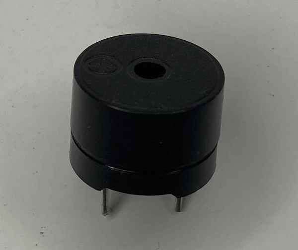
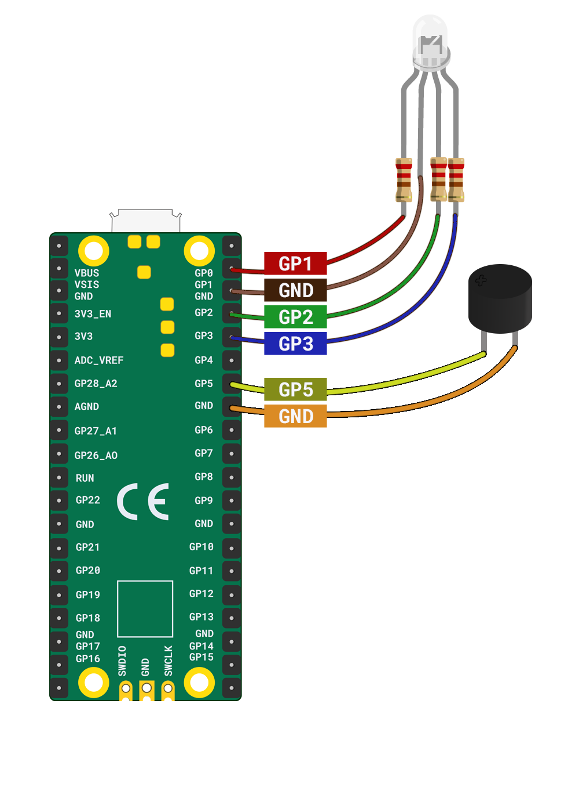

## Make a noise

Connect a speaker to the  Raspberry Pi Pico to play a sound when activated. 

{:width="300px"}

A party popper also makes a noise! In this step you will connect a **passive** buzzer to your Raspberry Pi Pico and code it to play a sound when your popper is pulled. 

There are two main types of buzzer, an **active** buzzer and a **passive** buzzer. An **active** buzzer always plays the same tone. A **passive** buzzer can play a variety of tones. It requires a connection to be made and a specific signal to play the chosen tone. 

<mark>Add an ingredient explaining the different types of buzzer, speaker and earphones that you can use.</mark>

--- task ---

**Look:** Notice that your buzzer has one long leg and one short leg. Just as with LEDs, the long leg is the positive (+) leg and the short leg is the ground (-) leg. If your buzzer legs are quite similar in height then take a look at the top of the buzzer and find the (+) symbol.

{:width="300px"}

--- /task ---

--- task ---

**Connect:** Connect the buzzer to your Raspberry Pi Pico using 2 x **socket-socket** jumper wires. Connect the long leg to **GP5**, and the short leg to the nearby **GND** (ground) pin.  

--- /task ---

Humans can hear sounds in the range 20 Hz (very low) to 20,000 Hz (very high). Children and young people can hear higher sounds than older people. Musical notes correspond to specific sound **frequencies**, for example the middle C (C4) is about 523 Hz. Hz, short for Hertz, is the number of vibrations per second. Sending the right signal to a buzzer will make it vibrate at a particular frequency which you will hear as a musical note. 

--- task ---

**Test:** Make sure your buzzer is connected properly by changing your `partypopper.py` script to match the following, then running your code. **Remember** to also import `Speaker` on **line 1**.

--- code ---
---
language: python
filename: partypopper.py
line_numbers: true
line_number_start: 1
line_highlights: 1,4,10
---
from picozero import RGBLED, Speaker
from time import sleep

rgb = RGBLED(red=1, green=2, blue=3) # pin numbers 
speaker = Speaker(5)

def pop():
    print("Pop") # print to the shell
    rgb.color = (255, 0, 255) # purple
    speaker.play(523, 1) # 523 = note C4, for 1 second
    rgb.off()

pop()
--- /code ---

--- /task ---

Right now, our party popper has light and sound that both work - the next step is to create an interesting combination of lights and sounds that will activate when our party popper is triggered. In this example we create a 'Ta-da!' celebration sound and have the LED flash purple in time with the effect.

--- task ---

**Edit:** Change your `partypopper.py` script to match the following:

--- code ---
---
language: python
filename: partypopper.py
line_numbers: true
line_number_start: 1
line_highlights:  10-15
---
from picozero import RGBLED, Speaker
from time import sleep

rgb = RGBLED(red=1, green=2, blue=3) # pin numbers
speaker = Speaker(5)

def pop():
    print("Pop") # print to the shell
    rgb.color = (255, 0, 255) # purple
    speaker.play(523, 0.1) # 523 = note C4, 0.1 seconds
    rgb.color = (0, 0, 0) # led no colour - off
    sleep(0.1)
    rgb.color = (255, 0, 255) # purple
    speaker.play(523, 0.6) # note C4, 0.6 seconds
    rgb.off()

pop()

--- /code ---

--- /task ---

--- task ---

**Test:** Run your code to see if the 'Ta-da!' sound effect plays and your LED flashes in time. 

{:width="300px"}

--- /task ---

--- task ---

**Debug:** 

You see the message `Speaker is not defined`:
+ Add `, Speaker` to the end of line 1.

If "Pop" message doesn't appear in the shell:
+ Check the Thonny console for any error messages and fix your code so it looks exactly like the example. 

If the RGB LED doesn't light up:
+ Check that the jumper wires are connected to the correct pins. 
+ Check for any lose connections. 
+ Check the LED has not blown.

<mark>Add an ingredient for checking that an LED is working.</mark>

If the buzzer doesn't make a sound:
+ Check that the correct legs are connected to the correct pins.
+ Check for loose connections.
+ Check you are playing a frequency you can hear: values should be between 15 - 15,000.
+ Check that you are using a **passive** buzzer.

--- /task ---

--- save ---