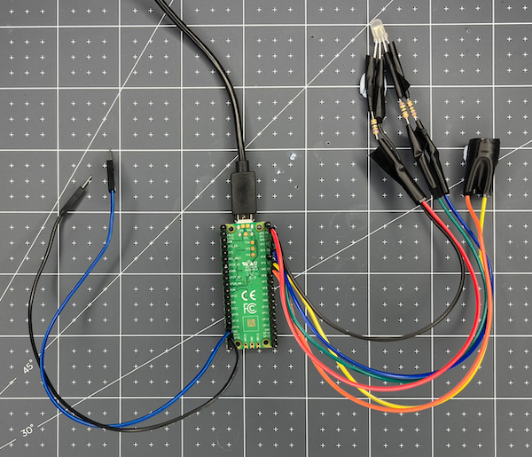

## Activate your party popper

Create a pull switch to activate your party popper.

{:width="300px"}

Technology is finding its way into all sorts of celebrations worldwide, creating lots of sustainable and reusable options for all kinds of fun displays and interactive entertainments. Now instead of disposable items like plastic party poppers or chemical fireworks, people are celebrating with drones, lasers and projection shows!

--- task ---

Get **2 x socket-pin** jumper wires to be used for your pull switch. 

**Connect:** Connect one jumper wire to **GP18** and one to the **GND** pin next to it. 

--- /task ---

In the LED Firefly project you checked `is_closed` in a loop to run different code if your switch was closed or open. Instead of checking in a loop, you can get `picozero` to call a function when a switch is opened or closed using `when_opened` and `when_closed`. 

There are two ways that you can run code based on the state of an input (like a switch or sensor). You can use a loop and keep checking the state of the input to see if it `is_open` or `is_closed`, this is called polling. Or, you can ask `picozero` to call a function when an input changes state, using events such as `when_opened` and `when_closed`. Using events can make your code simpler and means that input changes can be detected <b>when they happen</b> and won't be missed if you don't poll (check) the input at the right time. 

--- task ---

Change your code to tell `picozero` to call the `pop` function whenever the pull switch is opened (disconnected). **Remember** that you will also need to import `Switch` from `picozero` on line 1. 

--- code ---
---
language: python
filename: main.py 
line_numbers: true
line_number_start: 1
line_highlights: 1, 5, 19
---
from picozero import RGBLED, Speaker, Switch
from time import sleep

rgb = RGBLED(red=1, green=2, blue=3) # pin numbers 
pull = Switch(18)
speaker = Speaker(5)

def pop():
    print("Pop") # print to the shell
    rgb.color = (255, 0, 255) # purple
    speaker.play(523, 0.1) # 523 = note C4, 0.1 seconds
    rgb.color = (0, 0, 0) # led no colour - off
    sleep(0.1)
    rgb.color = (255, 0, 255) # purple
    speaker.play(523, 0.6) # note C4, 0.6 seconds
    rgb.off()
        
pull.when_opened = pop # The pop function will be called when the pull switch is opened

--- /code ---

**Tip:** Make sure you **don't** add `()` to the end of `pull.when_opened = pop`. This line tells `picozero` that every time the `when_opened` event happens, the `pop` function is called. 

--- /task ---

--- task ---

**Test**: 

Your RGB LED should light and the sound should play each time that the switch is **opened**. **Run** your code and make sure that this happens. 

**Debug**:

You see the message `Switch is not defined`:
+ Add `, Switch` to the end of line 1

If the code runs before you pull the switch:
+ Check to make sure your pull switch cables are connected to the correct pins.
+ Check to make sure your pull switch cables have a good connection with each other.
+ Check that you have removed the `pop()` line and replaced it with `pull.when_opened = pop`

If "Pop" message doesn't appear in the shell:
+ Check the Thonny console for any error messages and fix your code so it looks exactly like the example.

If the RGB LED doesn't light up:
+ Check that the correct legs are connected to the correct pins. 
+ Check for any lose connections. 
+ Check the LED has not blown.

If the buzzer doesn't make a sound:
+ Check that the correct legs are connected to the correct pins.
+ Check for loose connections.
+ Check you are playing a frequency you can hear: values should be between 15 - 15,000.
+ Check that you are using a **passive** buzzer.

--- /task ---

--- save ---

