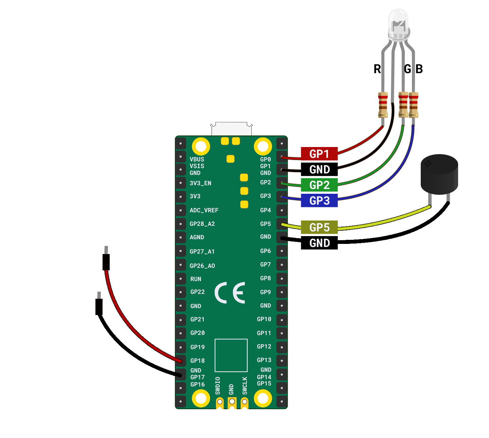

## Make your switch

Create a pull switch to activate your party popper.

{:width="300px"}

Technology is finding its way into all sorts of celebrations worldwide, creating lots of sustainable and reuable options for all kinds of fun displays and interactive entertainments. Now instead of disposable items like plastic party poppers or chemical fireworks, people are celebrating with drones, lasers and projection shows!

--- task ---

Get 2 x socket-pin jumper wires to be used for your pull switch. 

**Connect:** Connect one jumper wire to **GP18** and one to the **GND** pin next to it. 

--- /task ---

In the LED Firefly project you checked whether a switch was closed in a loop. Instead of checking in a loop, you can get `picozero` to call a function when a switch is opened or closed using `when_opened` and `when_closed`. 

--- task ---

Add code to call the `pop` function when the pull switch is opened (disconnected).

--- code ---
---
language: python
filename: main.py 
line_numbers: true
line_number_start: 1
line_highlights: 1, 5, 19
---
from picozero import RGBLED, Speaker, Switch
from time import sleep

rgb = RGBLED(red=1, green=2, blue=3) # pin numbers 
pull = Switch(18)
speaker = Speaker(5)

def pop():
    print("pulled")
    c_note = 523
    rgb.color = (255, 125, 0)
    speaker.play(c_note, 0.1)
    rgb.color = (0, 0, 0)
    sleep(0.1)
    rgb.color = (255, 125, 0)
    speaker.play(c_note, 0.6)
    rgb.off()
        
pull.when_opened = pop 

--- /code ---

**Tip:** Make sure you **don't** add `()` to the end of `pull.when_opened = pop`. This line tells `picozero` that every time the `when_opened` event happens, the `pop` function is called. 

--- /task ---

--- task ---

Now that you know your code is working, you can go ahead and make the party popper switch! First, you need to gather your materials:

- A pair of scissors
- Corrugated card
- Aluminium foil
- A glue stick

**Optional**:

- A pencil and a ruler (if you want to be more precise with your make)
- Some nice ribbon OR string OR coloured paper/card OR plain paper that you have coloured in

--- /task ---

--- task ---

Step content... 
Can use:
**Test:**
**Choose:**
**Tip:**

--- /task ---

--- save ---

