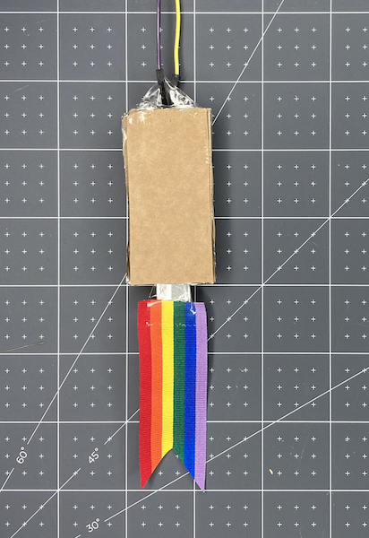
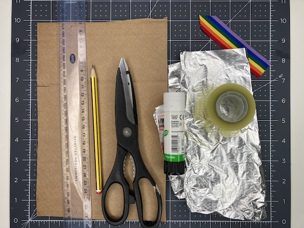
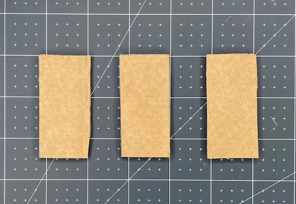
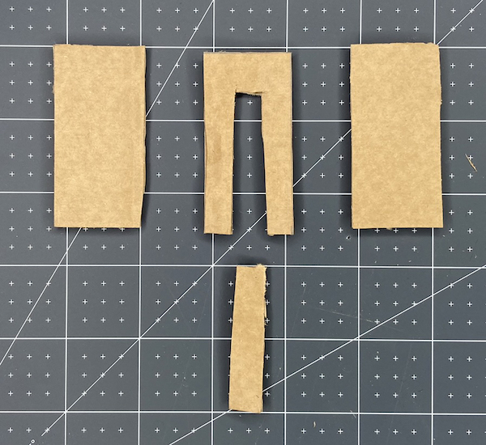
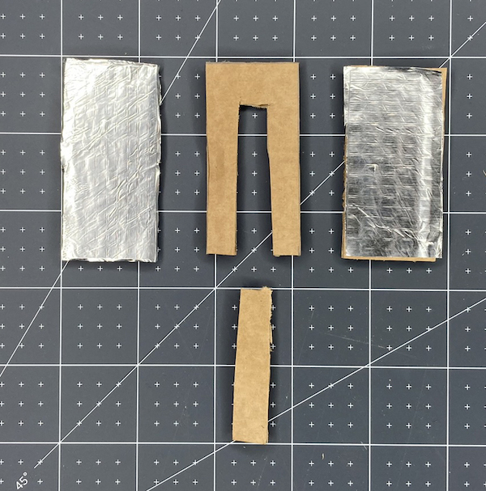
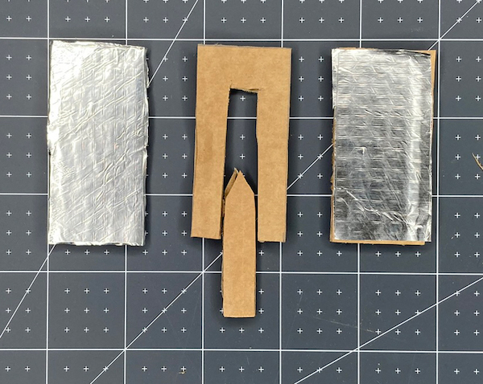
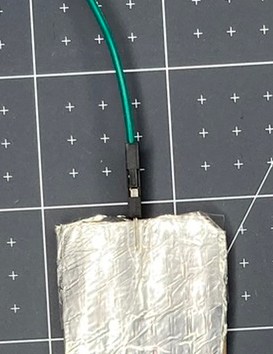
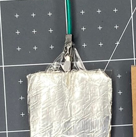
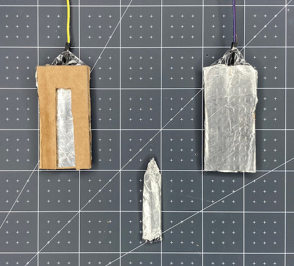
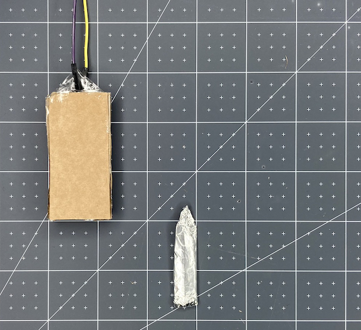

## Make your switch

Make a switch to activate your party popper using corrugated card, glue, and kitchen foil.

{:width="300px"}

--- task ---

Now that you know your code works, you need to make the switch that will set off your party popper! 

Gather your materials:

- A pair of scissors
- Corrugated card
- Kitchen foil
- A glue stick
- Some sticky tape

**Optional**:

- A pencil and a ruler (if you want to be more precise with your make)
- Some ribbon, string, coloured paper/card, or plain paper that you have coloured in

--- /task ---

--- task ---

Cut the **corrugated card** into three rectangles that are the same size. You can decide on the size of your party popper. The example is 3cm × 5cm. 

**Tip**: If you don't have a pencil and a ruler, then cut the first one and use it as a template for the other two. 

--- /task ---

--- task ---

Cut a section out of the centre of one of your rectangles. Keep the piece of card that you have cut out as this will be used later. 

--- /task ---

--- task ---

Take the **kitchen foil** and cut it to the same size as the un-cut rectangles.

**Glue** the cardboard and attach the foil. 

**Tip:** Make sure you don't get too much glue on the outside of the foil as it will affect the contacts of the switch. 

--- /task ---

--- task ---

Take the piece of card that you removed from the centre rectangle and cut the top into a V shape or a point to make it easier to place it inside your popper.

**Trim** the sides by a few millimetres to make sure that it will easily fit into your popper.

--- /task ---

--- task ---

Cover the removed piece in **kitchen foil**. It is very important that you use one piece of foil and that it wraps all the way around. This is what will make the switch close and allow the current to flow.

--- /task ---

--- task ---

**Disconnect your Raspberry Pi Pico from your computer.**

**Remove** the two jumper wires attached to the **GP18** and **GND** pins. 

Use some sticky tape to secure them to the top of each rectangle. 

**Tip:** It is important that the pins make a secure contact with the kitchen foil. Make sure that each pin is lying flat against the foil with the plastic part of the jumper wire against the edge of the cardboard. 

Add more tape to secure the jumper wire and stop it from accidentally coming loose.

--- /task ---

--- task ---

**Test**: Reattach your jumper wires to **GP18** and **GND** and your Raspberry Pi Pico back to your computer, then **run** your code. 

Close and open the switch by touching the two foiled rectangles together, foil to foil. The RGB LED and buzzer will play when the switch is open. 

--- /task ---

--- task ---

**Debug:** 

--- collapse ---

---
title: The popper is constantly going off
---

+ Check that your wires are really secure
+ Make sure that your fingers aren't touching the foil during testing as your body can complete and break the circuit and cause it to go off
+ If this error keeps happening, try remaking the rectangle cards and foil covers 

--- /collapse ---

--- collapse ---

---
title: The switch doesn't activate the popper
---

+ Check that the jumper wires are attached to the correct pins
+ Check the connections between the pins on the jumper wires and the foil are solid on both sides
+ Close and open your switch to make sure you are triggering the event
+ Make sure your code matches the example and that you have clicked **Run**

--- /collapse ---

--- /task ---

--- task ---

**Disconnect your Raspberry Pi Pico from your computer.**

**Remove** the jumper wires from the **GP18** and **GND** pins again so that you can complete your popper.

Add glue to one side of the piece of cardboard you removed the middle from and stick it to the foil-covered side of the left rectangle. 

This layer will create a barrier between the two pieces of foil and allow space for your centre piece to be placed inside. 

--- /task ---

--- task ---

Add glue to the other side of the piece of cardboard you removed the middle from, and stick the foil face of your other rectangle on top. Make sure that the two pieces of foil **are not** touching. You may need to trim your foil if it is overlapping.

--- /task ---

--- task ---

**Test**: 

- Connect your Raspberry Pi Pico to your computer
- Reattach your jumper wires  to **GP18** and **GND**
- Place the centre piece inside the popper to form a connection (close the switch)
- **Run** your code
- The code should run when you remove the centre piece from the popper

--- /task ---

--- task ---

**Debug**:

--- collapse ---

---
title: The switch doesn't activate the popper
---

+ Check that the jumper wires are attached to the correct pins
+ Check the connections between the pins on the jumper wires and the foil are solid on both sides
+ Push the middle piece inside your popper and pull it out again to trigger the event
+ Check the bits of foil on the outer pieces of card aren't permanently touching
+ Make sure that you have clicked **Run**

--- /collapse ---

--- /task ---

--- task ---

**Optional**: Add some ribbon, coloured card, string, or anything colourful to the end of your centre piece. This will make it more fun to pull your party popper!

--- /task ---
