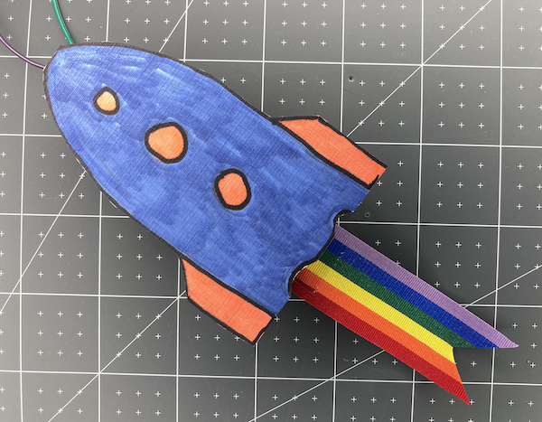

## Upgrade your project

If you have time, there are lots of upgrades you could make to your party popper. 

--- task ---

You could upgrade your party popper by:
+ Programming a longer sequence of light changes and sounds. You will get good results from note frequencies between 250 and 500.
+ Making a paper cone for your RGB LED and buzzer.
+ Decorating your paper popper switch or making it more robust. 

{:width="300px"}

--- /task ---

--- collapse ---

---
title: Completed project
---

You can view the [completed project here](https://rpf.io/p/en/party-popper-get){:target="_blank"}.

--- /collapse ---

--- save ---
