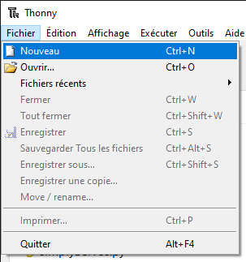

## Allumer ta LED RVB

Dans le projet luciole LED, tu as utilisé une LED monochrome. Pour ta bombe de fête, tu ajouteras une LED RVB (pleine couleur) à ton Raspberry Pi Pico et l'allumeras dans la couleur de ton choix.

{:width="300px"}

RVB signifie Rouge Vert Bleu. <b>Les LED RVB</b> te permettent d'utiliser un code pour contrôler la quantité de chaque couleur émise.

[[[generic-theory-simple-colours]]]

--- task ---

Assure-toi que ton Raspberry Pi Pico est **déconnecté** de ton ordinateur avant de connecter des composants, car tu risques de surcharger ou de court-circuiter les connexions et de les endommager.

--- /task ---

--- task ---

Câble ta **LED RVB** prête à se connecter au Pico en suivant les instructions ici :

[[[rgb-led-resistor-electrical-tape]]]

[[[rgb-led-resistor-solder-heat-shrink]]]

--- /task ---

--- task ---

Une LED RVB a **quatre** pattes, une pour chaque couleur et une pour une connexion partagée à **GND**.

Regarde ta LED RVB et assure-toi que tu peux identifier les quatre pattes. Dans le schéma ci-dessus, de gauche à droite, la première patte est la patte **rouge**, la deuxième patte est **GND** (masse), la troisième patte est **verte**, et la dernière patte est **bleue**.

**Remarque :** La patte **GND** (masse) est la branche la plus longue.

--- /task ---

--- task ---

Retourne ton Raspberry Pi Pico et trouve les broches étiquetées **GP1**, **GND**, **GP2**et **GP3**.

**Connecte** le fil de liaison attaché à la patte rouge de ta LED RVB à la broche **GP1**, la masse (négative) à **GND**, le vert à **GP2** et le bleu à **GP3** :

--- /task ---

--- task ---

**Connecte** ton Raspberry Pi Pico à ton ordinateur à l'aide du câble micro USB.

--- /task ---

--- task ---

Crée un nouveau fichier dans Thonny en cliquant sur **Fichier** > **Nouveau** dans la barre de menu supérieure. Un fichier vide s'ouvrira. Enregistre le fichier sous `bombe_fete.py`.

--- /task ---

--- task ---

Ajoute du code à `import` `RGBLED` et utilise-le pour créer une variable `rvb` afin de pouvoir programmer la LED RVB que tu as connectée aux broches **GP1**, **GND**, **GP2**et **GP3**.

--- code ---
---
language: python filename: party_popper.py line_numbers: true line_number_start: 1
line_highlights:
---
from picozero import RGBLED from time import sleep

rgb = RGBLED(red=1, green=2, blue=3) # Pin numbers

--- /code ---

**Astuce :** `RGBLED(rouge=1, vert=2, bleu=3)` peut également être écrit comme `RGBLED(1, 2, 3)`, en utilisant uniquement les numéros de broche connectés à chaque canal.

--- /task ---

--- task ---

Crée maintenant une fonction `pop` pour allumer la LED RVB et imprimer un message sur la console de Thonny afin que tu saches quand la fonction est appelée.

Tu dois également **appeler** la fonction avec `pop()`.

--- code ---
---
language: python filename: party_popper.py line_numbers: true line_number_start: 1
line_highlights: 6-12
---
from picozero import RGBLED from time import sleep

rgb = RGBLED(red=1, green=2, blue=3) # Pin numbers

def pop(): print("Pop") # Print to the shell rgb.color = (255, 0, 255) # Purple sleep(2) rgb.off()

pop() # Call the pop function

--- /code ---

--- /task ---

--- task ---

**Test :** Exécute ton script et vérifie que la LED RVB passe au violet (rouge maximum et bleu maximum) pendant deux secondes puis s'éteint. Vérifie également que tu vois le mot « Pop » imprimé dans la console de Thonny chaque fois que tu exécutes ton script.

{:width="300px"}

**Déboguer :**

--- collapse ---

---
title: Je vois le message `RGBLED is not defined`
---

Assure-toi que la ligne 1 a `from picozero import RGBLED`

--- /collapse ---

--- collapse ---

---
title: Le message "Pop" n'apparaît pas dans la console
---

Vérifie la console de Thonny pour tout message d'erreur et corrige ton code afin qu'il ressemble exactement à l'exemple.

--- /collapse ---

--- collapse ---

---
title: Le message "Pop" apparaît mais la RVB ne s'allume pas
---

Si la LED RVB ne s'allume pas :
+ Vérifie que les fils de liaison sont connectés aux bonnes broches correctes
+ Vérifie les connexions mal fixées
+ Vérifie que la LED n'a pas brûlé (cassé) en l'échangeant avec une autre LED

--- /collapse ---

--- collapse ---

---
title: La LED RVB s'allume mais n'est pas violette
---

Il se peut que les pattes de la LED soient connectées aux mauvaises broches. Essaie de régler la LED RVB sur les couleurs suivantes et assure-toi que la LED RVB affiche la bonne couleur : rouge `(255, 0, 0)`, vert `(0, 255, 0)`, bleu `(0, 0, 255)`. Échange les fils de liaison si nécessaire. Si une seule couleur fonctionne, tu peux avoir la patte de masse connectée à la couleur de cette broche.

--- /collapse ---

**Astuce :** L'utilisation de `print` pour envoyer des messages à la console de Thonny est utile lorsque tu débogues des scripts pour le Raspberry Pi Pico.

--- /task ---

--- task ---

**Choisis :** Si tu souhaites une couleur différente, modifie les chiffres qui définissent la couleur :

+ Rouge : (255, 0, 0)
+ Vert : (0, 255, 0)
+ Bleu : (0, 0, 255)
+ Cyan : (0, 255, 255)
+ Jaune : (255, 255, 0)
+ Rose : (255, 0, 50)

Essaie d'ajuster les chiffres pour obtenir le bon équilibre.

**Astuce :** Mélanger le rouge, le vert et le bleu crée du blanc.

**Astuce :** Si tu trouves que la LED est trop lumineuse, tu peux utiliser une valeur inférieure. Par exemple, `(100, 0, 0)` affichera toujours une couleur rouge, mais elle ne sera pas aussi brillante que `(255, 0, 0)`.

--- /task ---
