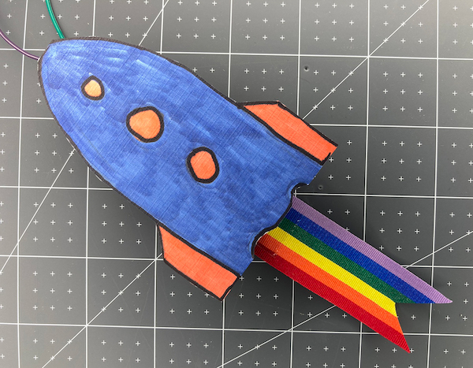

## Améliorer ton projet

Si tu as le temps, tu peux apporter de nombreuses améliorations à ta bombe de fête.

Peux-tu penser à un événement que tu pourrais célébrer avec ta bombe de fête ?

Tu peux garder une bombe de fête prête à célébrer chaque fois que tu corriges un bogue, termines un projet ou apprends une nouvelle compétence.

--- task ---

Tu pourrais :

+ Programmer une séquence plus longue de changements de lumière et de sons. Tu obtiendras de bons résultats à partir de fréquences de notes comprises entre 250 et 500.
+ Fabriquer un cône en papier pour ta LED RVB et ton buzzer.
+ Décorer ton interrupteur de bombe en papier ou rends-le plus robuste.
+ Personnaliser ta bombe de fête avec des couleurs et des sons pour un événement spécifique. Peux-tu utiliser les couleurs de ton équipe sportive préférée ou le drapeau de ton pays ? Tu peux programmer une mélodie liée à l'événement.

{:width="300px"}

--- /task ---

--- collapse ---

---
title: Le projet achevé
---

Tu peux voir le [projet terminé ici](https://rpf.io/p/en/party-popper-get){:target="_blank"}.

--- /collapse ---
