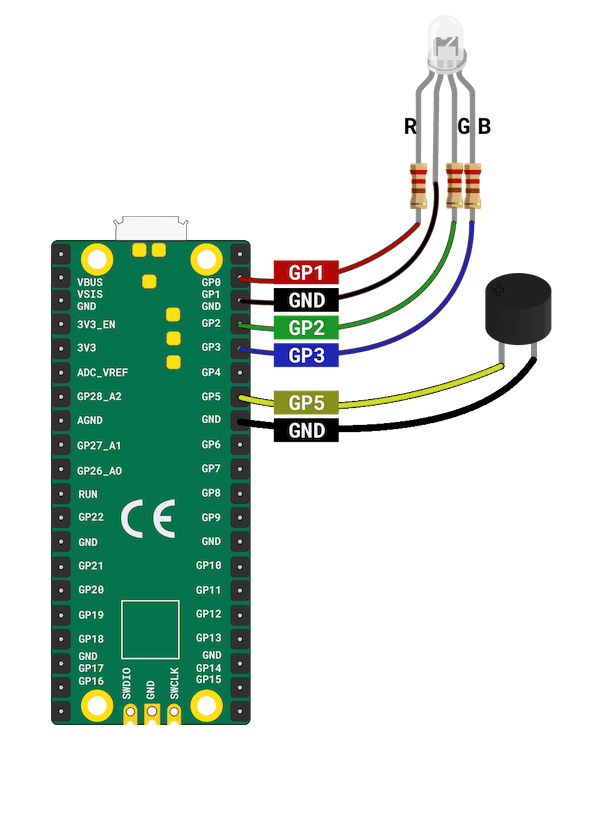

## Maak een geluid

Een feestknaller maakt ook een geluid! In deze stap verbind je een **passieve** zoemer met je Raspberry Pi Pico en codeer je die om een geluid af te spelen wanneer aan je knaller wordt getrokken. 

{:width="300px"}

Er zijn twee hoofdtypen zoemers, een **actieve** zoemer en een **passieve** zoemer. Een **actieve** zoemer speelt altijd dezelfde toon. Een **passieve** zoemer kan verschillende tonen afspelen. Het vereist een verbinding en een specifiek signaal om de gekozen toon te kunnen afspelen. 

[[[buzzers-speakers]]]

--- task ---

Merk op dat je zoemer een lang en een kort pootje heeft. Net als bij LED's is het lange pootje het positieve (+) pootje en het korte pootje het aarde (-) pootje. Als de pootjes van de zoemer ongeveer even groot zijn, kijk dan naar de bovenkant van de zoemer en zoek het (+) symbool.

{:width="300px"}

--- /task ---

--- task ---

**Sluit de zoemer aan ** op je Raspberry Pi Pico met behulp van twee **bus–bus** jumperdraden. Verbind het lange been met **GP5**, en het korte been met de nabijgelegen **GND** (aarde) pen.

--- /task ---

Mensen kunnen geluiden horen in het bereik van 20 Hz (zeer laag) tot 20.000 Hz (zeer hoog). Kinderen en jongeren kunnen hogere geluiden horen dan oudere mensen. Muzieknoten komen overeen met specifieke geluids-**frequenties**; de middelste C (C4) is bijvoorbeeld ongeveer 262 Hz. Hz, kortweg Hertz, is het aantal trillingen per seconde. Door het juiste signaal naar een zoemer te sturen, zal het op een bepaalde frequentie trillen, die je als een muzieknoot zult horen. 

--- task ---

**Test:** werk je `party_popper.py` script bij zodat het overeenkomt met het volgende en voer vervolgens je code uit om de zoemer te testen. **Vergeet niet** om ook `Speaker` te importeren op **regel 1**.

--- code ---
---
language python filename: party_popper.py line_numbers: true line_number_start: 1
line_highlights: 1, 5, 10
---
from picozero import RGBLED, Speaker from time import sleep

rgb = RGBLED(red=1, green=2, blue=3) # Pin numbers speaker = Speaker(5)

def pop(): print("Pop") # Print to the shell rgb.color = (255, 0, 255) # Purple speaker.play(262, 1) # 262 = note C4, for 1 second rgb.off()

pop() --- /code ---

--- /task ---

Je feestknaller heeft licht en geluid. Maak vervolgens een interessante combinatie van licht en geluid die wordt geactiveerd wanneer je feestknaller afgaat. In dit voorbeeld maken we een 'Ta-da!' feestgeluid met een paarse LED die op hetzelfde ritme knippert als het geluid.

--- task ---

Wijzig het `party_popper.py` script zodat het overeenkomt met het volgende:

--- code ---
---
language: python filename: party_popper.py line_numbers: true line_number_start: 1
line_highlights:  10-15
---
from picozero import RGBLED, Speaker from time import sleep

rgb = RGBLED(red=1, green=2, blue=3) # Pin numbers speaker = Speaker(5)

def pop(): print("Pop") # Print to the shell rgb.color = (255, 0, 255) # Purple speaker.play(262, 0.1) # 262 = note C4, 0.1 seconds rgb.color = (0, 0, 0) # LED no colour – off sleep(0.1) rgb.color = (255, 0, 255) # Purple speaker.play(262, 0.6) # Note C4, 0.6 seconds rgb.off()

pop()

--- /code ---

--- /task ---

--- task ---

**Test:** Voer je code uit om te zien of het 'Ta-da!' geluidseffect wordt afgespeeld en de LED knippert op hetzelfde ritme.

{:width="300px"}

--- /task ---

--- task ---

**Fouten oplossen:**

--- collapse ---

---
title: Ik zie het bericht `Speaker is not defined`
---

Voeg `, Speaker` toe aan het einde van regel 1.

--- /collapse ---

--- collapse ---

---
title: Het "Knal" bericht verschijnt niet in de shell
---

Controleer de Thonny-console op foutberichten en herstel je code zodat het er precies zo uitziet als het voorbeeld.

--- /collapse ---

--- collapse ---

---
title: De RGB LED licht niet op
---

Als de RGB-LED niet gaat branden:
+ Controleer of de jumperdraden op de juiste pennen zijn aangesloten
+ Controleer op losse verbindingen
+ Controleer of de LED niet is doorgebrand

--- /collapse ---

--- collapse ---

---
title: De zoemer maakt geen geluid
---

Als de zoemer geen geluid maakt:
+ Controleer of de juiste pootjes zijn aangesloten op de juiste pennen
+ Controleer op losse aansluitingen
+ Controleer of je een frequentie speelt die je kunt horen: De waarden moeten tussen 15 en 15.000 liggen
+ Controleer of je een **passieve** zoemer gebruikt

--- /collapse ---

--- /task ---
